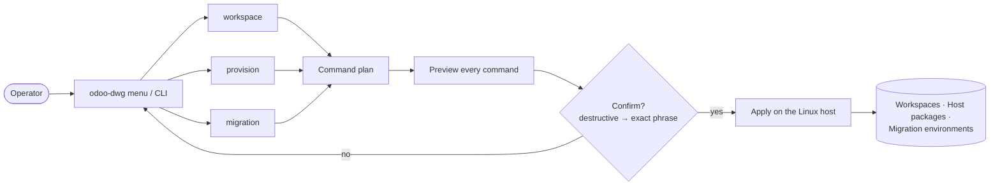

# odoo_dwg — Odoo development & migration workspace generator

A **zero-runtime-dependency** (Python standard library only) command-line tool that **generates and
maintains Odoo Community development workspaces** and **OpenUpgrade migration environments** on a **Linux
host** — WSL Ubuntu 24.04, a bare server, or a container. The host is *yours*; this tool prepares and manages
what runs on it. It is a sibling of [`odoo_instance_manager`](https://github.com/grojof/odoo_instance_manager_app)
and shares its UI, menus, and the safe **plan → preview → apply** contract.

> **Status:** all three surfaces — **workspace**, **provision**, and **migration** (now with preflight
> verification and custom-module staging) — are implemented and validated on WSL Ubuntu 24.04.
> See [`docs/roadmap.md`](docs/roadmap.md).

## How it works

Nothing touches your host without you seeing exactly what will run:



## Why not Docker?

The goal is a workspace as faithful as possible to production: a real Linux + PostgreSQL + venv-per-instance,
the way Odoo's own **"source install"** works. Docker (or WSL, or a plain server) is a fine *host* — but this
tool provisions and generates workspaces *on* whatever Linux you give it, rather than hiding it behind an image.

## What it does

Two optional user-facing **sections** plus one **mode**:

| Surface | What it does | Requires root? |
|---|---|---|
| **workspace** | Per-client workspaces: shared Odoo/OCA repo cache, per-instance venv, `addons-custom`/`addons-oca`, per-version `odoo.conf`, VSCode files, and a robust per-workspace README. | No (user's home) |
| **provision** *(optional)* | Prepare *a Linux host*: build dependencies, PostgreSQL + role, wkhtmltopdf, and rtlcss for right-to-left languages (opt-in). Optionally, an [outbound firewall that denies by default and asks, plus local mail capture](docs/egress-control.md) (OpenSnitch + Mailpit). Targets Ubuntu 24.04, per the [support matrix](docs/support-matrix.md). | `apply` may |
| **migration** *(mode)* | OpenUpgrade chained upgrade **12 → 19** (sequential, no skips): **preflight verification** (host, dump, database, addons coverage), per-version interpreters via `uv`, **custom-module staging** (OCA `odoo-module-migrator` + analysis findings + scaffolds), a checkpointing driver, and environment cleanup. | No |

## Install & first run

```bash
git clone https://github.com/grojof/odoo_dev_workspace_generator
cd odoo_dev_workspace_generator

python3 -m odoo_dwg                 # interactive menu (asks language on start)
```

Common invocations:

```bash
python3 -m odoo_dwg workspace       # create/manage per-client workspaces
python3 -m odoo_dwg -v provision    # --verbose: stream every command's output
python3 -m odoo_dwg provision       # check first — read-only readiness table:
#   State  Capability               Detail
#   OK     PostgreSQL               installed and running
#   OK     wkhtmltopdf              wkhtmltopdf 0.12.6.1 (with patched qt)
#   OK     uv (interpreters)        present — provides 3.8, 3.10, 3.12 …

python3 -m odoo_dwg migrate         # generate env / preflight / stage custom modules / clean
ODWG_LANG=es python3 -m odoo_dwg    # Spanish UI (English is the default)
```

Every command, menu action, and confirmation phrase: [`docs/commands.md`](docs/commands.md).

## Requirements

- A **Linux** host (target: Ubuntu 24.04) — don't have one? [`docs/wsl-setup.md`](docs/wsl-setup.md) sets up
  Ubuntu 24.04 on WSL 2 step by step. Development *of this tool* works on any OS; real end-to-end
  generation is validated on WSL/Linux.
- `python3` ≥ 3.12 (the tool itself; Ubuntu 24.04's system Python). Host tools it orchestrates — `git`, `psql`/`createdb` and `uv`
  (which provides every migration step's interpreter) — are checked by `provision check`, not bundled. No
  container runtime is needed.

## Supported versions

- **Development:** Odoo **17.0 / 18.0 / 19.0** (first class).
- **Migration:** the full **12.0 → 19.0** OpenUpgrade chain (one step per version).
- **Python, PostgreSQL and hosts per version:** the [support matrix](docs/support-matrix.md), with the official
  source behind every bound.

## Design principles

Standard library only · English canonical (Spanish optional UI) · plan → preview → apply · pure planners ·
every Odoo/OpenUpgrade fact anchored to **official sources** and cited bound by bound in
[`docs/support-matrix.md`](docs/support-matrix.md) · assistant-agnostic
(no AI/MCP installed).

## Documentation

By surface:

- **Using the tool** — [`docs/commands.md`](docs/commands.md) (every command and menu action).
- **Workspaces** — [`docs/workspace-layout.md`](docs/workspace-layout.md) (generated tree, conventions) ·
  [`docs/configuration-reference.md`](docs/configuration-reference.md) (JSON profile fields).
- **Host setup** — [`docs/wsl-setup.md`](docs/wsl-setup.md) (Ubuntu 24.04 on WSL 2, from zero) ·
  [`docs/provisioning.md`](docs/provisioning.md) (host check/apply).
- **Migration** — [`docs/migration.md`](docs/migration.md) (interpreters, preflight, staging, checkpointing driver).
- **Host safety** — [`docs/egress-control.md`](docs/egress-control.md) (the outbound firewall that denies by
  default and asks, the local mail capture, and redirecting a copied database's mail).
- **Editor** — [`docs/editor-integration.md`](docs/editor-integration.md) (the official Odoo extension, what a
  workspace emits for it, and how to keep up with its releases).
- **What is supported** — [`docs/support-matrix.md`](docs/support-matrix.md) (hosts, Python per Odoo version,
  PostgreSQL — with the source behind every bound and how to re-verify it).
- **Project** — [`docs/roadmap.md`](docs/roadmap.md) (phases + backlog) · [`CLAUDE.md`](CLAUDE.md) (AI-agent
  guide) · [`CONTRIBUTING.md`](CONTRIBUTING.md) · [`SECURITY.md`](SECURITY.md) ·
  [`CHANGELOG.md`](CHANGELOG.md).
- Non-trivial changes are **spec-first** via OpenSpec (`/opsx:*`); specs live in `openspec/specs/`.

## License

AGPL-3.0-or-later.
