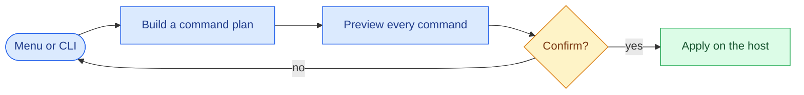
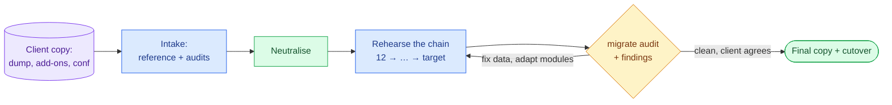

# odoo_dwg — Odoo development & migration workspace generator

A command-line tool that builds **Odoo Community development workspaces** and runs **OpenUpgrade
migrations from 12.0 to 19.0** on a Linux host that you own. It needs only the Python standard library. It
never changes the host without first showing you every command it will run.

> **Status:** v0.2.0 released. Workspace, provisioning and migration are implemented and validated on WSL
> Ubuntu 24.04, and the migration side has carried a real 12 → 18 client migration through two
> rehearsals. Details are in the [roadmap](docs/project/roadmap.md) and the [changelog](CHANGELOG.md).

## What it does

| | |
|---|---|
| **Workspaces** | A workspace per client and several Odoo versions (12.0–19.0) side by side. Odoo and OCA code is cloned once and shared. Each instance gets its own venv, `odoo.conf`, `addons-custom` / `addons-oca`, VS Code files set up for the official Odoo extension, and a README. |
| **Host provisioning** *(optional)* | Build dependencies, PostgreSQL and its role, wkhtmltopdf and rtlcss. Optionally, an outbound firewall that denies by default and asks first (OpenSnitch), and local mail capture (Mailpit). |
| **Taking in a client copy** | Restores the dump into a reference database that nobody modifies, and creates a read-only role that cannot see secrets. It classifies the client's add-ons and identifies their core (official or OCB, down to the commit). It audits their own modules from their data, and finds data the target will refuse. |
| **Migration 12 → 19** | Each version uses its own interpreter through `uv`. A preflight checks the host, the dump and add-on coverage. Custom modules are staged. The driver takes a checkpoint after each step, runs your own pre and post hooks, and repairs known OpenUpgrade defects. |
| **Safe copies of production** | Neutralises crons, tax and EDI links, payments, IAP and mail, and records every change inside the database. The driver neutralises again after every step, and giving production's settings back is always your own explicit action. |
| **Checks and findings** | `migrate audit` looks for the data problems that break or distort a migration. A findings ledger keeps the evidence and the client's decisions, and renders the client and internal reports in English or Spanish. |

## How it works

Everything that changes the host goes through the same contract. Destructive actions ask you to type an
exact phrase.



A migration, from the client's copy to the cutover:



## Quick start

```bash
uv tool install git+https://github.com/grojof/odoo_dev_workspace_generator   # or pipx install git+…
odoo-dwg                           # the interactive menu; add --lang es for Spanish
```

From a clone, with nothing installed: `python3 -m odoo_dwg`. It is the same entry point.

```bash
odoo-dwg workspace                 # create and manage per-client workspaces
odoo-dwg provision                 # check the host (read-only table), then apply if you choose
odoo-dwg migrate                   # environments, intake, preflight, staging, runs, findings
odoo-dwg -v provision              # --verbose: stream every command's output
```

**Read-only checks** write nothing and never prompt, so they work in scripts and in a second terminal while
a migration runs. The exit code is the verdict: 0 clean, 1 found something, 2 could not tell.

```bash
odoo-dwg migrate audit --database <db>     # data that breaks or distorts a migration
odoo-dwg migrate report --source 12.0 --target 18.0
odoo-dwg neutralise check --database <db>  # can this copy still act on the outside?
odoo-dwg mail check --database <db>        # can its mail leave?
odoo-dwg egress check                      # are the firewall rules still the tool's?
```

Every command, menu action and confirmation phrase is in [commands](docs/reference/commands.md).

**Requirements:**
- a Linux host (Ubuntu 24.04 is the target; with nothing yet, follow the [WSL 2 setup](docs/host/wsl-setup.md));
- `python3` 3.12 or newer.

The host tools the tool drives (`git`, `psql`, `uv`…) are checked by `provision`. No container runtime is
needed. Which Python and PostgreSQL each Odoo version takes is in the
[support matrix](docs/reference/support-matrix.md), with the official source behind every bound.

## Documentation

| I want to… | Read |
|---|---|
| Find a command, a menu action or a confirmation phrase | [Commands](docs/reference/commands.md) |
| Prepare a host from nothing | [WSL 2 setup](docs/host/wsl-setup.md) · [Provisioning](docs/host/provisioning.md) |
| Keep a host from reaching the outside, and capture mail | [Egress control and mail capture](docs/host/egress-control.md) |
| Create a workspace and understand its tree | [Workspace layout](docs/workspace/layout.md) · [Profile fields](docs/workspace/configuration.md) · [Editor](docs/workspace/editor.md) |
| Migrate a database | [Overview](docs/migration/README.md), then in order: [environment](docs/migration/environment.md) → [intake](docs/migration/intake.md) → [copies of production](docs/migration/production-copies.md) → [rehearsing](docs/migration/rehearsing.md) → [running](docs/migration/running.md) → [checks and findings](docs/migration/checks-findings.md) |
| Know what is supported, and why | [Support matrix](docs/reference/support-matrix.md) |
| See where the project is going | [Roadmap](docs/project/roadmap.md) · [Changelog](CHANGELOG.md) |
| Contribute | [CONTRIBUTING](CONTRIBUTING.md) · [CLAUDE.md](CLAUDE.md) (guide for AI agents) · [SECURITY](SECURITY.md) |

Assistants get thin skills in `.claude/skills/` over the read-only checks: migration triage, the migration
coherence check, the OpenSnitch rule check and the Mailpit configuration.

## Design principles

- **Standard library only** at runtime.
- **Plan → preview → confirm → apply**, with pure planners.
- **English canonical**, with Spanish as an optional UI language.
- **Every Odoo and OpenUpgrade fact anchored to an official source**, and re-verified by a `tools/verify_*`
  script.
- **Host-agnostic**: WSL, a bare server or a container.
- **Nothing AI-related is installed.** The generated workspace README is the context for any assistant.
- **Spec-first changes** through OpenSpec. The specs live in `openspec/specs/`.

**Why not Docker?** The aim is a workspace as close to production as possible: real Linux, PostgreSQL and a
venv per instance, the way Odoo's own source install works. A container is a fine *host*; this tool works
on whatever Linux you give it.

## License

AGPL-3.0-or-later.
