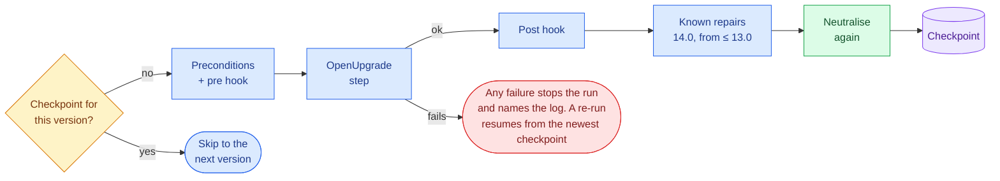

# Running a migration

Check the host and the dump, run the chain on a copy, follow it, and read what it left. The environment
must exist first ([environment](environment.md)).

## Preflight: verify before you burn hours

**Menu → Migration → Preflight check** runs a read-only verification, and the same checks run
automatically when generating an environment (host scope) and inside the driver — its four host checks
(everything in the Host row below except the addons layout, which only the menu and generate flows check)
plus the whole database scope:

| Scope | Checks |
|-------|--------|
| Host | `uv` (every step's interpreter); PostgreSQL reachable + dev role; the dump exists and `pg_restore --list` parses it (which also enforces the required custom format, `pg_dump -Fc` — plain SQL dumps are rejected); addons layout present |
| Database | actual source version from `ir_module_module` (`base`) vs. the declared source; installed-module list; **per-step coverage** — every installed module must resolve in every step's `addons_path`, and each miss names the exact directory to fill |

The database scope needs a live database: name an already-restored one in the menu action, or let the
driver verify right after its initial restore (it aborts before step 1 on any failure). For a ≤ 13 step,
coverage looks in the OpenUpgrade fork itself: its `addons` and `odoo/addons`, and its renames in
`odoo/addons/openupgrade_records/lib/apriori.py`.

**What the chain installs by itself.** A step installs modules the source never had: dependencies an
upgraded module now declares, then `auto_install` glue modules. OpenUpgrade's 13.0 loader and its
framework from 18.0 install every glue module whose requirements are met; between them Odoo installs one
only when something it needs is new. The preflight reads which rule each step's checkout applies,
lists the modules as *Installed by the chain (13.0)*, and checks them at every later step. A dependency
no source has is a **MISSING** row. When the intake's cached OCA trees have it, the preflight names the
repository to add (`account_statement_base (16.0): OCA has it in account-reconcile`).

## Running the migration

The driver **works on a copy, never production**. Take a custom-format dump of the source database (plain
SQL dumps are rejected), copy its filestore, and hand the dump to the driver:

```bash
# On the source host — custom format (-Fc) is required:
pg_dump -Fc -h <source-host> -U <source-user> <source-db> -f source-13.0.dump

# The attachments live outside the database. Copy the source filestore to this
# host under the working database's name, or every ir_attachment row in the
# migrated database will point at a file that is not there:
rsync -a <source>/.local/share/Odoo/filestore/<source-db>/ \
      ~/.local/share/Odoo/filestore/migration_13_to_18/

cd ~/odoo-migrations/13-to-18
bash run_migration.sh /path/to/source-13.0.dump
```

It preflights the host, restores the dump into a working database on the shared PostgreSQL, verifies the
database (version match, addons coverage) before step 1, then runs each step with
`--update all --stop-after-init` (Odoo ≥ 14: `--load=base,web,openupgrade_framework`), and **`pg_dump`s a
checkpoint after each successful step**. Any preflight failure exits non-zero with a `[preflight-fail]` line
naming the check. A `[fail]` line is the driver's own abort: a checkpoint that cannot be written, a step
whose `odoo-bin` failed (it names the step's log file), a step whose OpenUpgrade code is not on disk — Odoo
would migrate nothing and say nothing in that case, so the driver checks before running it — or checkpoints
that came from a different source dump.

Each step of the chain, as the generated `run_migration.sh` runs it:



**The working database.** Each environment upgrades **its own** database on the shared PostgreSQL, named
after its chain — `migration_13_to_18` for a 13 → 18 environment — which a fresh run drops and recreates
from the dump. Two *different* chains can therefore run at once; two runs of the *same* chain cannot, and
the second would drop the first's database. Nothing ever touches the source database.

A checkpoint is a `pg_dump` of that database — a full copy of whatever you restored, production data
included — and `logs/<version>.log` is Odoo's log for it. The driver keeps `checkpoints/` and `logs/`
at `700` and writes into them at `600`, so a second account on the host cannot read them. An environment
that predates that is narrowed the next time you generate over it: upgrading the tool alone changes
nothing already on disk.

**When a step fails.** The driver names the step and its log (`[fail] step 16.0 failed — see
logs/16.0.log`). Read that log: the cause is usually one of your own modules under
`addons/odoo<major>/custom` that has not been adapted to that version. Fix it there, then run the same
command again — it resumes from the last checkpoint rather than from the source. Re-running without fixing
anything fails identically.

**When it finishes.** `[done] migration complete` leaves the result in the `migration_13_to_18` database on the
shared cluster. Open it through the environment's own script, which neutralises it again before every start
([why](production-copies.md#opening-a-migrated-database-for-testing)):

```bash
~/odoo-migrations/13-to-18/open_for_testing.sh 18.0 migration_13_to_18
```

To take it away: `pg_dump -Fc -h 127.0.0.1 -U odoo migration_13_to_18 -f migrated-18.0.dump` (and the filestore
directory alongside it).

**Resuming.** Run the same command again after a failure.
- **What it restores:** before the first step still missing, the driver restores the **newest checkpoint**
  into the working database. A failed step can leave that database half-migrated, because OpenUpgrade commits
  module by module, so it is never migrated again as it stands.
- **One source dump per run:** the first run records the dump's SHA-256 in `checkpoints/source.sha256`. A
  re-run with a different dump is refused, because the checkpoints belong to the first one. To start over
  from another dump, remove the whole `checkpoints/` directory — removing only some of it is what the driver
  is protecting you from.
- **Checkpoints with no recorded hash** — a `checkpoints/` directory that has dumps but no
  `source.sha256` — stop the driver, because it cannot tell whether they are this dump's. It prints the
  one command that adopts them if they are; remove the directory if they are not.

### What the run leaves behind, step by step

Besides each step's `logs/<version>.log`, the driver appends one line per event to `logs/steps.tsv`:

```
2026-09-20T11:32:51+02:00	a1b2c3d4e5f6	-	run-start	12.0 -> 18.0
2026-09-20T11:32:55+02:00	a1b2c3d4e5f6	13.0	start
2026-09-20T11:41:02+02:00	a1b2c3d4e5f6	13.0	ok
2026-09-20T11:41:05+02:00	a1b2c3d4e5f6	14.0	start
2026-09-20T11:49:00+02:00	a1b2c3d4e5f6	14.0	fail	1
```

The columns are *when*, *which run* (the source dump's hash, so several runs can share the file), *which
step*, *what happened* and a detail:

| Event | Detail |
|---|---|
| `run-start`, `run-ok` | the chain, on start |
| `restore` | what was restored: `00_source`, or the checkpoint a re-run resumes from |
| `neutralised` | the step after which the database was neutralised again |
| `start`, `ok`, `skip` | — |
| `fail` | the step's exit code |
| `hook-pre`, `hook-post` | the hook file that ran |
| `repair` | which repair ran after the step |

It is **appended and never rewritten**, so a run you interrupt still leaves a readable record, and it
accumulates across runs: the file is the history of every attempt on this chain.

Two things it is for. You can follow a run live:

```bash
tail -f ~/odoo-migrations/12-to-18/logs/steps.tsv      # where the chain is
tail -f ~/odoo-migrations/12-to-18/logs/14.0.log       # what that step is saying
```

And the timestamps are in the form `journalctl` takes, so a step's window can be handed to the firewall's
journal rather than guessed at — which is how you find out what a step tried to reach:

```bash
journalctl -t opensnitch --since "2026-09-20T11:41:05+02:00" --until "2026-09-20T11:49:00+02:00" \
  | grep odoo-bin
```

With the [outbound firewall](../host/egress-control.md) installed, `odoo-bin` is rejected anywhere but localhost, so
anything in that window is a step reaching for the outside — worth knowing before that code reaches
production.

### When the client's data breaks a migration script: step hooks

A migration script can meet data it does not expect. The first client's 14.0 step stopped because
OpenUpgrade gives every bank statement line a journal entry, and some lines belonged to closed banks
whose accounts were deprecated. What to do is a decision about the client's data, so it is yours, in
the environment:

- `hooks/<version>-pre.sql` runs before that step;
- `hooks/<version>-post.sql` runs after the step succeeds, and before its checkpoint, so the checkpoint
  holds what the post-step hook restored.

Each file runs in one transaction and stops at its first error. The driver prints `[hook] 14.0 pre: …`
and records it in `logs/steps.tsv`. A failing pre hook stops the run before the step; a failing post hook stops it before the checkpoint. Keep a pre-step change
reversible and have the post-step hook undo exactly it. For example, record which deprecated accounts
you make usable in a table of your own, and deprecate exactly those again. Record the decision in the
findings ledger too.

### A known OpenUpgrade 14.0 defect the driver repairs: statement lines stored as reconciled

For a source up to 13.0, OpenUpgrade's 14.0 account post-migration gives every bank statement line
without an entry one, through the ORM (`fill_statement_lines_with_no_move`). It then computes the lines'
`is_reconciled` and `amount_residual` in raw SQL (`fill_account_bank_statement_line_reconciliation`). There
is no flush in between. The ORM still holds the values it computed while each move had no suspense line
yet (`is_reconciled = True`), and a later flush writes them over the SQL result.

A line still waiting in the suspense account then reads as reconciled, and the reconciliation screen,
which filters on that field, hides it. How many lines are hit depends on how many pending values the ORM
still holds when the script ends: on the first client's copy it was part of such lines in one run and
all of them in another.

The driver repairs it right after the 14.0 step and its post hook, before the checkpoint. It selects in
SQL the only lines the defect can leave wrong: stored as reconciled while their move still has a line on
the journal's suspense account. It then recomputes them in `odoo-bin shell` on the 14.0 Odoo with Odoo's
own `_compute_is_reconciled` (the same rule as in 18.0), prints how many it selected and how many are
still reconciled, and records `repair statement-lines-is-reconciled` in `logs/steps.tsv`. Only those lines go through the ORM, so it
takes seconds on a large database, and it selects nothing once OpenUpgrade flushes itself
([OCA/OpenUpgrade#6005](https://github.com/OCA/OpenUpgrade/pull/6005)).

### A known OCA defect the same repair covers: the SII certificate file

Up to 13.0, `l10n_es_aeat_sii` keeps the AEAT certificate (the `.p12`) in a column of its own table. The
14.0 migration of `l10n_es_aeat_sii_oca` creates one `l10n.es.aeat.certificate` per old record, but it
moves attachments only, so the file never reaches the new model. The same run of the 14.0 repair carries
each file from the old table, through OpenUpgrade's legacy link, when the new certificate has none, and
records `repair sii-certificate-file` whether or not there was a file to carry (its output says how many). The keys are files on the old server's disk: on the new server,
open each certificate and obtain the keys again with its password.

### When a module has no code anywhere: `decisions.json`

Coverage stops a run when an installed module resolves in no source of a step and OpenUpgrade declares no
successor for it. That is not a bug to work around — it is a question only you can answer, and it happens
for real: OCA ported `website_sale_product_attribute_filter_category` to 14.0, 15.0, 17.0 and 18.0 but
**not** to 16.0 or 19.0.

Record the answer in the environment's own `decisions.json`. The driver reads that file; **Preflight
check** asks for a file, usually that one. For an **official or OCA** module the decision is the same for
every client migrating between the same two versions, so one file of yours can serve them all:

```json
{
  "decisions": [
    {
      "module": "website_sale_product_attribute_filter_category",
      "source": "12.0", "target": "19.0",
      "decision": "dropped",
      "reason": "OCA has not ported it to 16.0 or 19.0 (present in 14, 15, 17, 18)",
      "evidence": {"checked": "2026-09-20"}
    }
  ]
}
```

Both readings honour it — the preflight action *and* the driver, which is the one that stops the run — and
a decision is matched under **any name the module carries in the chain**, since a rename does not make it a
different module. An applied decision is always named in the output with its reason, never applied
silently:

```
[coverage] website_sale_product_attribute_filter_category: dropped for 16.0 — as you recorded (OCA has not
ported it to 16.0 or 19.0)
```

**A decision is never believed over the sources.** It is applied only while the module still resolves
nowhere and still has no successor that does; when either changes — OCA ports it, OpenUpgrade declares a
successor — the preflight reports the decision as **stale** instead of applying it. A file that cannot be
read decides nothing, so a typo cannot open the gate. That matters most for OCA, which ports modules
continuously: a module recorded as dead a year ago may have a branch today.

The file is the operator's, carried between clients: the fates of Odoo and OCA modules are facts the tool
derives every time, and this records the one thing no source states.

Record or change a decision without editing the file by hand:

```bash
odoo-dwg migrate decide website_sale_product_attribute_filter_category --source 12.0 --target 19.0 \
  --decision dropped --reason "OCA has not ported it to 16.0 or 19.0"          # prints the entry
odoo-dwg migrate decide … --write                                              # records it
```

The kinds are `kept`, `deferred`, `dropped`, `renamed` and `replaced`; the last two name the module(s)
that carry this one with `--to`. The entry for the same module and pair is replaced where it stands, and
nothing else in the file changes.

### The client's own modules under new names: the client-modules stage

A client's own modules reach the target one of two ways, and you choose per module:

- **Adapted in place**: same name, its target-version code in `addons/odoo<major>/custom`. The target step
  migrates it with its own scripts. Nothing more to do.
- **Refactored while porting**: new names (often under a prefix you use for that client), several old
  modules folded into one, some replaced by an OCA or standard module, some retired. Record each fate as
  a decision for the source → target pair:

| Decision | `--to` | At the target |
|---|---|---|
| `renamed` | one module, or several for a split | the old module's record and identifiers become the (first) new module's; several renamed to one are merged into it; then the new module is updated, so its `migrations/<version>/` scripts run on the old data. For a split, the other modules named are installed in the same run |
| `replaced` | one or more | the replacements are installed, then the old module is uninstalled |
| `dropped` | — | uninstalled, if still installed |
| `kept`, `deferred` | — | left as they are; named if still installed with no code |

After the target step the driver runs a **client-modules stage** from those decisions, read when it runs
(no regeneration after editing them):

1. `hooks/<target>-modules-pre.sql`, when present;
2. the renames, with OpenUpgrade's own `update_module_names` (merging);
3. one plain Odoo run (no OpenUpgrade framework): `-u` the renamed modules, `-i` the replacements;
4. the uninstalls, last: an old module can be the only owner of a table its replacement adopts. The stage
   refuses an uninstall that would take along a module no decision drops or replaces;
5. `hooks/<target>-modules-post.sql`, neutralise, and a checkpoint `<target>-modules`.

Before touching the database it refuses a `to` module that is not in the target's sources, has an
unreadable manifest, is not installable, or has a version of another series. It uninstalls nothing unless
what it updated and installed is installed. With nothing to carry it says so and writes no checkpoint. A
stage that stopped half-way leaves a marker, and the next run restores the target checkpoint before
anything else. **`dropped` decisions made before this stage existed now take effect:** the modules still
installed are uninstalled, which used to be done by hand. Check the plan first, against the migrated database if you have one:

```bash
odoo-dwg migrate modules --source 12.0 --target 18.0 --database migration_12_to_18
```

While porting, repeat only this stage from the target checkpoint, without the chain:

```bash
./run_migration.sh data/source.dump --redo-modules
```

Renaming a field is the new module's job, in its own `migrations/<version>/pre-migration.py`
(`openupgrade.rename_fields`, which also carries saved filters and export templates). To split one old
module into several, name them all in `--to`, the part that owns its data first:

```bash
odoo-dwg migrate decide acme_custom --source 12.0 --target 18.0 --decision renamed \
  --to acme_stock_inventory acme_report acme_mrp --write
```

The first is renamed from it and runs its migration scripts; the others are installed new, and a new
install runs none. Whatever the old module owned that belongs to them is the first module's to hand over
in its own pre-migration (moving the `ir_model_data` rows to the part's name), or theirs to rebuild.

### Following a run while it happens

You start the driver by hand, and a 12 → 19 chain takes hours. **Menu → Migration → Follow a running
migration**, from another terminal, shows where it is:

```
Migration 12.0 → 19.0  (a1b2c3d4e5f6)
+------+-----------+---------+
| Step | State     | Elapsed |
+------+-----------+---------+
| 13.0 | ok        | 8m 07s  |
| 14.0 | ok        | 12m 31s |
| 15.0 | running   | 3m 12s  |
| 16.0 | pending   | —       |
+------+-----------+---------+

15.0 — worth reading so far
| WARNING | odoo.modules.loading  | 412 | sale_x: field removed |
| ERROR   | odoo.modules.registry | 1   | could not load sale_x |

Reached outside its own machine
  reject pypi.org ×3 (00-odwg-003-reject-odoo-external)
```

It only reads. **Ctrl-C stops watching; the driver keeps going** — it is another process. When the run ends
the watch says how, and points you at the report, because the live view follows the *running* step and so
its last frame holds no detail.

If you would rather not leave a terminal on it, the two files behind that view are plain text: `tail -f`
them ([above](#what-the-run-leaves-behind-step-by-step)).

### The report: what happened, and what is still open

**Menu → Migration → Report on the runs so far** reads the step log, each step's Odoo log and the firewall's
journal, and writes `reports/report-<stamp>.md` into the environment. It is generated when you ask for it;
the history it reads from is what accumulates.

It opens with **Still open**, which is the part that matters:

```markdown
## Still open

- **Step 18.0 failed** — exit 1 — see …/logs/18.0.log
- **Step 17.0 passed with 3 error line(s)** — first: could not load sale_x
```

That second kind is the one worth having: a step can exit zero and still have logged errors, and "the chain
finished" is not the same as "nothing went wrong".

Then, per step of the latest run, its log summarised by what the lines actually carry — level, logger,
message and **how many times** it occurred:

```markdown
| Level | Logger | Count | First message |
| --- | --- | --- | --- |
| ERROR | `odoo.modules.registry` | 1 | could not load sale_x |
| WARNING | `odoo.modules.loading` | 412 | sale_x: field removed |
```

Counted rather than repeated: one broken field emits the same warning per record, and four hundred copies of
it would hide the error above. Nothing here tells you what a warning *means* — that is your judgement, and
inventing categories would be asserting something about OpenUpgrade this project has not verified.

And, where the firewall is installed, what the step reached for — asked of the journal **for that step's own
window**, and only for that step's process:

```markdown
**The step reached outside its own machine:**

- `reject` pypi.org ×3 (rule `00-odwg-003-reject-odoo-external`)
```

A step marked *skip* is shown as having run nothing that time, so its silence is not read as a clean run.
