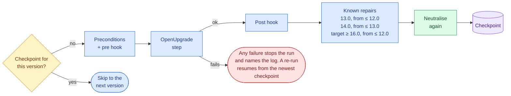

# Running a migration

Check the host and the dump, run the chain on a copy, follow it, and read what it left. The environment
must exist first ([environment](environment.md)).

## Preflight: verify before you burn hours

**Menu → Migration → Preflight check** runs a read-only verification, and the same checks run
automatically when generating an environment (host scope) and inside the driver — its four host checks
(everything in the Host row below except the addons layout, which only the menu and generate flows check)
plus the whole database scope:

| Scope | Checks |
|-------|--------|
| Host | `uv` (every step's interpreter); PostgreSQL reachable + dev role; the dump exists and `pg_restore --list` parses it (which also enforces the required custom format, `pg_dump -Fc` — plain SQL dumps are rejected); addons layout present |
| Database | actual source version from `ir_module_module` (`base`) vs. the declared source; installed-module list; **per-step coverage** — every installed module must resolve in every step's `addons_path`, and each miss names the exact directory to fill |

The database scope needs a live database: name an already-restored one in the menu action, or let the
driver verify right after its initial restore (it aborts before step 1 on any failure). For a ≤ 13 step,
coverage looks in the OpenUpgrade fork itself: its `addons` and `odoo/addons`, and its renames in
`odoo/addons/openupgrade_records/lib/apriori.py`.

**What the chain installs by itself.** A step installs modules the source never had: dependencies an
upgraded module now declares, then `auto_install` glue modules. OpenUpgrade's 13.0 loader and its
framework from 18.0 install every glue module whose requirements are met; between them Odoo installs one
only when something it needs is new. The preflight reads which rule each step's checkout applies,
lists the modules as *Installed by the chain (13.0)*, and checks them at every later step. A dependency
no source has is a **MISSING** row. When the intake's cached OCA trees have it, the preflight names the
repository to add (`account_statement_base (16.0): OCA has it in account-reconcile`).

## Running the migration

The driver **works on a copy, never production**. Take a custom-format dump of the source database (plain
SQL dumps are rejected), copy its filestore, and hand the dump to the driver:

```bash
# On the source host — custom format (-Fc) is required:
pg_dump -Fc -h <source-host> -U <source-user> <source-db> -f source-13.0.dump

# The attachments live outside the database. Copy the source filestore to this
# host under the working database's name, or every ir_attachment row in the
# migrated database will point at a file that is not there:
rsync -a <source>/.local/share/Odoo/filestore/<source-db>/ \
      ~/.local/share/Odoo/filestore/migration_13_to_18/

cd ~/odoo-migrations/13-to-18
bash run_migration.sh /path/to/source-13.0.dump
```

It preflights the host, restores the dump into a working database on the shared PostgreSQL, verifies the
database (version match, addons coverage) before step 1, then runs each step with
`--update all --stop-after-init` (Odoo ≥ 14: `--load=base,web,openupgrade_framework`), and **`pg_dump`s a
checkpoint after each successful step**. Any preflight failure exits non-zero with a `[preflight-fail]` line
naming the check. A `[fail]` line is the driver's own abort: a checkpoint that cannot be written, a step
whose `odoo-bin` failed (it names the step's log file), a step whose OpenUpgrade code is not on disk — Odoo
would migrate nothing and say nothing in that case, so the driver checks before running it — or checkpoints
that came from a different source dump.

Each step of the chain, as the generated `run_migration.sh` runs it:



**The working database.** Each environment upgrades **its own** database on the shared PostgreSQL, named
after its chain — `migration_13_to_18` for a 13 → 18 environment — which a fresh run drops and recreates
from the dump. Two *different* chains can therefore run at once; two runs of the *same* chain cannot, and
the second would drop the first's database. Nothing ever touches the source database.

A checkpoint is a `pg_dump` of that database — a full copy of whatever you restored, production data
included — and `logs/<version>.log` is Odoo's log for it. The driver keeps `checkpoints/` and `logs/`
at `700` and writes into them at `600`, so a second account on the host cannot read them. An environment
that predates that is narrowed the next time you generate over it: upgrading the tool alone changes
nothing already on disk.

**When a step fails.** The driver names the step and its log (`[fail] step 16.0 failed — see
logs/16.0.log`). Read that log: the cause is usually one of your own modules under
`addons/odoo<major>/custom` that has not been adapted to that version. Fix it there, then run the same
command again — it resumes from the last checkpoint rather than from the source. Re-running without fixing
anything fails identically.

**When it finishes.** `[done] migration complete` leaves the result in the `migration_13_to_18` database on the
shared cluster. Open it through the environment's own script, which neutralises it again before every start
([why](production-copies.md#opening-a-migrated-database-for-testing)):

```bash
~/odoo-migrations/13-to-18/open_for_testing.sh 18.0 migration_13_to_18
```

To take it away: `pg_dump -Fc -h 127.0.0.1 -U odoo migration_13_to_18 -f migrated-18.0.dump` (and the filestore
directory alongside it).

**Resuming.** Run the same command again after a failure.
- **What it restores:** before the first step still missing, the driver restores the **newest checkpoint**
  into the working database. A failed step can leave that database half-migrated, because OpenUpgrade commits
  module by module, so it is never migrated again as it stands.
- **One source dump per run:** the first run records the dump's SHA-256 in `checkpoints/source.sha256`. A
  re-run with a different dump is refused, because the checkpoints belong to the first one. To start over
  from another dump, remove the whole `checkpoints/` directory — removing only some of it is what the driver
  is protecting you from.
- **Checkpoints with no recorded hash** — a `checkpoints/` directory that has dumps but no
  `source.sha256` — stop the driver, because it cannot tell whether they are this dump's. It prints the
  one command that adopts them if they are; remove the directory if they are not.

### What the run leaves behind, step by step

Besides each step's `logs/<version>.log`, the driver appends one line per event to `logs/steps.tsv`:

```
2026-09-20T11:32:51+02:00	a1b2c3d4e5f6	-	run-start	12.0 -> 18.0
2026-09-20T11:32:55+02:00	a1b2c3d4e5f6	13.0	start
2026-09-20T11:41:02+02:00	a1b2c3d4e5f6	13.0	ok
2026-09-20T11:41:05+02:00	a1b2c3d4e5f6	14.0	start
2026-09-20T11:49:00+02:00	a1b2c3d4e5f6	14.0	fail	1
```

The columns are *when*, *which run* (the source dump's hash, so several runs can share the file), *which
step*, *what happened* and a detail:

| Event | Detail |
|---|---|
| `run-start`, `run-ok` | the chain, on start |
| `restore` | what was restored: `00_source`, or the checkpoint a re-run resumes from |
| `neutralised` | the step after which the database was neutralised again |
| `start`, `ok`, `skip` | — |
| `fail` | the step's exit code |
| `hook-pre`, `hook-post` | the hook file that ran |
| `repair` | which repair ran after the step |

It is **appended and never rewritten**, so a run you interrupt still leaves a readable record, and it
accumulates across runs: the file is the history of every attempt on this chain.

Two things it is for. You can follow a run live:

```bash
tail -f ~/odoo-migrations/12-to-18/logs/steps.tsv      # where the chain is
tail -f ~/odoo-migrations/12-to-18/logs/14.0.log       # what that step is saying
```

And the timestamps are in the form `journalctl` takes, so a step's window can be handed to the firewall's
journal rather than guessed at — which is how you find out what a step tried to reach:

```bash
journalctl -t opensnitch --since "2026-09-20T11:41:05+02:00" --until "2026-09-20T11:49:00+02:00" \
  | grep odoo-bin
```

With the [outbound firewall](../host/egress-control.md) installed, `odoo-bin` is rejected anywhere but localhost, so
anything in that window is a step reaching for the outside — worth knowing before that code reaches
production.

### When the client's data breaks a migration script: step hooks

A migration script can meet data it does not expect. The first client's 14.0 step stopped because
OpenUpgrade gives every bank statement line a journal entry, and some lines belonged to closed banks
whose accounts were deprecated. What to do is a decision about the client's data, so it is yours, in
the environment:

- `hooks/<version>-pre.sql` runs before that step;
- `hooks/<version>-post.sql` runs after the step succeeds, and before its checkpoint, so the checkpoint
  holds what the post-step hook restored.

Each file runs in one transaction and stops at its first error. The driver prints `[hook] 14.0 pre: …`
and records it in `logs/steps.tsv`. A failing pre hook stops the run before the step; a failing post hook stops it before the checkpoint. Keep a pre-step change
reversible and have the post-step hook undo exactly it. For example, record which deprecated accounts
you make usable in a table of your own, and deprecate exactly those again. Record the decision in the
findings ledger too.

### A known OpenUpgrade 14.0 defect, fixed upstream: statement lines stored as reconciled

For a source up to 13.0, OpenUpgrade's 14.0 account post-migration gives every bank statement line
without an entry one, through the ORM (`fill_statement_lines_with_no_move`). It then computes the lines'
`is_reconciled` and `amount_residual` in raw SQL (`fill_account_bank_statement_line_reconciliation`).
There used to be no flush in between: the ORM still held the values it computed while each move had no
suspense line yet (`is_reconciled = True`), and a later flush wrote them over the SQL result. A line
still waiting in the suspense account then read as reconciled, and the reconciliation screen hid it.

[OCA/OpenUpgrade#6005](https://github.com/OCA/OpenUpgrade/pull/6005) flushes the lines before the SQL.
It was merged into 14.0 on 2026-09-25, so the driver no longer repairs anything here:
- **Before the 14.0 step** it checks that the checkout's `account/14.0.1.1/post-migration.py` holds that
  flush. It stops before the step when the checkout predates it, with the command that updates it
  (`git -C <checkout> pull --ff-only`, or regenerating the environment).
- **After the step and its post hook** it counts the lines stored as reconciled whose entry still has a
  line on the suspense account, with the same selection `migrate audit` uses. None records
  `check statement-lines-is-reconciled` in `logs/steps.tsv`. Any stops the step before its checkpoint,
  with the count: with the fix, that would be a defect nobody knows about yet.

### A known OCA defect the driver repairs after the 14.0 step: the SII certificate file

Up to 13.0, `l10n_es_aeat_sii` keeps the AEAT certificate (the `.p12`) in a column of its own table. The
14.0 migration of `l10n_es_aeat_sii_oca` creates one `l10n.es.aeat.certificate` per old record, but it
moves attachments only, so the file never reaches the new model. Right after the 14.0 step, the driver carries
each file from the old table, through OpenUpgrade's legacy link, when the new certificate has none, and
records `repair sii-certificate-file` whether or not there was a file to carry (its output says how many). The keys are files on the old server's disk: on the new server,
open each certificate and obtain the keys again with its password.

### Filed declarations keep their boxes: a map a module no longer ships

The OCA AEAT modules store each filed declaration's boxes (`l10n_es_aeat_tax_line`) linked to the journal
items that make them up, and each box points at the map line it was computed with, with a cascading
foreign key. When a later version of a module stops shipping an old map, Odoo deletes that map's records at
the module update, and every filed declaration of those periods loses its boxes. OCA's 303 module dropped
its July 2021 to December 2022 map in 17.0, and one of that map's boxes in 13.0. Nothing fails.

So the driver copies, at the source restore, every box, its links, and the maps and map lines they use
(`keep filed-declarations` in the step record). At the target, after the post hook and before the
grouped-items repair, it puts back whatever the chain deleted, with the same ids. It checks that every box
the source held is there with its filed amount, or keeps nothing and stops. It lists what it put back in
`logs/<target>-declaration-boxes-put-back.tsv` (`repair filed-declarations`). Computing such a period
again needs the old map's taxes, which the module no longer has; what was filed is what the boxes hold.

### A known OpenUpgrade 13.0 defect the driver repairs: taxes added to reused journal items

OpenUpgrade 13.0 (`migration_invoice_moves`) builds each invoice line from the journal item the 12.0
invoice had posted, where it can match one. It then gives every reused item its invoice line's taxes with
`INSERT … ON CONFLICT DO NOTHING`, so it *adds* them to the taxes the item already bore and takes none
away. An item grouped in the source, or a payable line matched to an invoice line, can end up bearing two
sets. Its amount does not change, but it now counts in the base of every tax it bears. The OCA AEAT
declarations select lines by their taxes, so a VAT or withholding return recomputed after 13.0 is wrong
for those periods. On the first client this changed a few VAT return and withholding periods, one of them
not filed yet.

What the item bore exists only in the source. For a source up to 12.0:
1. **At the source restore**, before the source checkpoint, the driver copies the source's
   `account_move_line_account_tax_rel` and its highest journal-item id into tables of its own. It records
   `keep source-move-line-taxes`.
2. **Right after the 13.0 step** and its post hook, while tax ids are still the source's, it takes back
   from each reused item (one that existed in the source and that OpenUpgrade linked to an invoice line)
   every tax that the item did not bear in the source and that its invoice line did.

The repair changes no amount, account or balance: it only removes those rows of the relation. Taxes
changed for any other reason stay, such as tax-group children the new model no longer puts on items. Each
tax taken back is listed in `logs/13.0-taxes-taken-back.tsv`, the step record gets `repair
move-line-taxes`, and the tool's tables are dropped.

A run resumed from a source checkpoint taken before this repair existed has nothing to compare with. It
records `repair move-line-taxes-skipped` and says so: only a run from the source dump repairs it.

### A known OpenUpgrade 16.0 defect the driver repairs: grouped invoice items

Up to 12.0, an invoice can be posted with its journal items grouped: one per account and taxes instead of
one per invoice line (the journal's *Group invoice lines*, or a module doing the same). OpenUpgrade 13.0
(`migration_invoice_moves`) keeps such an item with the amount, marks it `exclude_from_invoice_tab`, and
inserts the invoice lines it stands for with a zero balance. 13.0 to 15.0 hide the item. OpenUpgrade 16.0
(`_account_move_fast_fill_display_type`) types it `product` without reading that flag. From 16.0 on,
every such invoice shows an extra "/" line with its whole amount, while its real lines carry none.

Accounts and tax-based declarations stay right. The invoice analysis does not: every such sale and
purchase lands under "no product", quantities count twice, and margins by product are wrong. Every
reprint and every credit note carries the extra line. Resetting one such invoice to draft makes Odoo
itself move the amounts back to the lines.

For a chain from 12.0 or older to 16.0 or later, the driver does that for every invoice. It runs right
after the target step and its post hook, before the checkpoint, in one SQL transaction, one group at a
time: one move, one account and one set of taxes.
- **An amount only moves inside a group**, so no account's, partner's or tax's sum can change. A VAT
  return or EC sales list filed from the source recomputes the same. On the first client's database every
  filed one was recalculated before and after, identical.
- **Each line takes its own amount** in the document's direction, and the cents of rounding go to the
  largest line. On a reconcilable account the lines stay open, as the grouped item was.
- **A line OpenUpgrade 13.0 gave the union of its group's taxes** takes back its own, read from the
  source's `account_invoice_line_tax`.
- **A source journal item at zero that OpenUpgrade 13.0 reused as an invoice line** (its invoice line
  marked `aml_matched`) keeps its zero, taxes and links: a filed declaration box may count it. A group
  that needed it is left.
- **What pointed at the grouped item moves.** A many-to-many link is copied to the lines. An analytic line
  and an EC sales list detail move to the largest line.

Before committing, the repair checks, per move:
- balances per account and partner, per tax, and the move's balance;
- the invoices' stored amounts;
- that no link or reference was lost;
- that every record a repaired grouped item was linked to (a declaration box, a VAT book line) adds up
  to the same over its journal items: what an auditor sees when drilling into a box.

If any check fails, nothing is kept and the run stops, naming the check.

A group is left as it is, and listed with its reason in `logs/<target>-grouped-invoice-items-left.tsv`,
when:
- its amounts do not add up;
- the invoice is in a foreign currency;
- the grouped item is already reconciled, partly or fully;
- the grouped item has no invoice line;
- something else points at the grouped item (a reconciliation, say).

In the step record it is `repair grouped-invoice-items`. A resumed run finds it in the checkpoint.
Analysing the first client's database, the left groups were invoices the source itself held
inconsistently: lines at zero with a journal entry edited by hand, or entry taxes that differ from the
lines'.

### Known defects the driver repairs in payments: duplicates, journals, states

Three things are wrong with a migrated database's payments, and no step repairs them:
- OCA `account_payment_order` 14.0 creates one payment per bank payment line, joining the journal items
  that carry the line. When an operator's own entry repeats a line's reference (an expense or a reversal
  of a remittance), the line gets one payment per entry. Every payment list then counts the extra ones,
  though no journal item points at them.
- OpenUpgrade 18.0 fills a payment's journal from its entry only when the entry's journal is a bank, cash
  or credit one. A payment order posted through a miscellaneous journal leaves its payments with none,
  though Odoo 18 requires one.
- OpenUpgrade 18.0 marks a payment `paid` only when its entry's `payment_state` is, which a payment's
  entry never is in 17. Every posted payment stays "In process". The payment-order payments also keep
  empty reconciliation flags.

When the chain crosses 18.0, the target step repairs them after the grouped items and before its
checkpoint, and lists everything in `logs/<target>-payments-repaired.tsv`:
1. **Duplicates**, in SQL. A bank payment line with several payments keeps the one on its order's own
   entry. The others are removed only when nothing points at them but their own links: their own entry,
   and payment lines the kept payment also has. Anything else keeps them, listed as `duplicate-kept` with
   the reason.
2. **Journals**, in SQL. A payment with no journal gets its order's journal, when that journal is a bank,
   cash or credit one with exactly one method line for the payment's method. An ORM write would rewrite
   the payment's entry, so this is SQL, and the entry keeps its journal and name. Payments left without
   a journal are listed as `no-journal`.
3. **States**, with the target's own Odoo. Every posted payment's state and reconciliation flags, then
   every posted invoice's payment status, are recomputed with Odoo's methods, and nothing is written
   through the ORM. A payment's state reads its invoices' status, and an invoice's reads its payments', so
   the recompute repeats until neither changes. Every journal item and entry is fingerprinted before and
   after; any difference rolls it all back and stops the step.

An invoice settled only by credit notes, or a credit note settled only by journal entries, is "Reversed"
in 18, where 12 had no such status: the recompute gives it that status, and lists it.

### Stock valuation a source up to 12.0 gets: aligned to on-hand quantity and cost

Up to 12.0 there are no valuation layers: a product is worth its stock on hand times its cost.
OpenUpgrade 13.0 builds the layers by replaying moves and price history, and two flaws of that replay
leave value away from quantity times cost:
- in 12.0 a receipt's averaged cost reaches the price history a moment before the move, so the replay
  counts it once as a revaluation and once as the receipt;
- a receipt that brings negative stock back to zero keeps its value on no quantity.

The layers' quantity can also differ from the stock on hand where the source's quants and moves already
disagreed. Odoo 18 values products from their layers, so its valuation screens show neither the source's
figure nor the stock there is, and its average cost would take the drift in.

For a target from 18.0, after the payments repair and before the checkpoint, the target's own Odoo adds
one layer per storable product that differs. The layer is labelled "Migration: align to on-hand quantity
and cost", and its quantity and value bring the product to the stock Odoo values (internal locations, and
transit ones with a company; not stock another owner holds), at the product's cost.
- Average-cost products get their remaining quantity and value on that layer, as emptying and refilling
  the stock does.
- Only periodic valuation is aligned. Automated-valuation, FIFO and lot-valued products are left and
  listed.
- Nothing is kept if a journal entry would appear, a cost would change, or a product would not end
  aligned.
- The list is `logs/<target>-valuation-aligned.tsv`.

The source valued internal locations only; Odoo 18 also values a transit location with a company. A quant
in transit therefore makes the 18 figure differ from the source's by exactly its value.

### Tax grids after a chain that crosses 17.0: refreshed from the chart template

From 17.0 a localisation's tax report generates signed tax tags (`+mod303[01]`, `-mod303[01]`), and its
tax templates reference them. A database migrated from an older version keeps its first chart's unsigned
tags on every tax repartition line and journal item.
- The native step that retags existing taxes is the chart template's reload (`l10n_es` runs it in
  `migrations/5.4/end-migrate.py`).
- OpenUpgrade 17.0 turns it off. Its own script then tries to delete the old tags, which foreign keys
  refuse.
- New invoices would carry grids no 18 report reads. Journal items may also carry every box of their tax,
  a union OpenUpgrade 13.0 left.

When the chain crosses 17.0, the target step runs the target's own Odoo after the valuation alignment:
1. **The chart template's reload, restricted to taxes.** For a tax whose template is unchanged (amount
   type, amount, number of repartition lines), only its repartition lines' tags are set from the
   template. Any other tax is left and listed.
2. **Every journal item's grids from repartition lines**, the rule Odoo applies when it posts:
   - a tax line takes its repartition line's tags;
   - a base line takes its taxes' base repartition tags for the document's type (credit note or
     invoice);
   - lines of plain entries, whose type depends on more than the move, are left and counted.
3. **Old tags archived.** Tax tags that nothing uses and no tax report generates are archived, not
   deleted.

Nothing is kept if a journal item's amounts, taxes or sign would change. The list is
`logs/<target>-tax-grids.tsv`. The OCA AEAT declarations select journal items by tax, not by grid, so
their figures do not change. The grids serve reports that read tags, and the documents posted from now on.

### Configuration the chain changes, put back as the source had it

OpenUpgrade changes some configuration on the way that the operator never asked to change:
- **Return types.** 15.0 gives each warehouse a "Returns" operation type and points its delivery type's
  returns at it, and its receipt type's at the delivery type. It overwrites what was there, so a warehouse
  whose customer returns went to its own type loses that flow.
- **Operation types created active.** 18.0 creates the multi-step reception types (storage, quality
  control, cross-dock) active on every active warehouse, where Odoo creates them archived for a one-step
  warehouse. It fills the default locations 18 requires only on active types.
- **The invoice-matching rule.** 13.0 deletes Odoo's default reconciliation rule.
- **Journal mail aliases.** 13.0 recreates each journal's alias under the journal's name instead of its
  own.

For a target from 18.0, the driver keeps the source's return types, reconciliation rules and alias names
at the source restore (`keep source-configuration` in the step record). After the tax grids, the target's
Odoo:
- puts back each type's source return type;
- archives the types the chain created that nothing uses (a created type something already uses stays
  active, and is listed);
- computes the missing default locations with Odoo's own rule, only where they are missing;
- recreates the deleted default rule with the source's values, including whether it validated
  automatically, with the renames and the tolerance inversion OpenUpgrade 15.0 applies;
- gives each journal alias its source name.

The list is `logs/<target>-source-configuration.tsv`. A resumed run whose source checkpoint predates
this skips it, says so, and records `repair source-configuration-skipped`.

### Pending installs with no code, cancelled after the target step

OpenUpgrade 18.0 patches `update_list` to mark "to install" every auto-install module whose recorded
dependencies are installed, even when its code no longer exists. Dependencies merged or renamed along
the chain make old auto-install modules look satisfied. Odoo skips them and reports "Some modules have
inconsistent states" at every later module operation.

When the chain crosses 18.0, the target step runs the target's Odoo last before its checkpoint:
- each pending install whose code Odoo cannot find (`get_module_path`) is cancelled with
  `button_install_cancel`, as the Apps screen does;
- a pending install whose code exists is left for you to install or cancel.

Both are listed in `logs/<target>-module-states.tsv`. Modules left "to upgrade" with no code are the
client's own, waiting for their port; `decisions.json` and the client-modules stage deal with those.

### When a module has no code anywhere: `decisions.json`

Coverage stops a run when an installed module resolves in no source of a step and OpenUpgrade declares no
successor for it. That is not a bug to work around — it is a question only you can answer, and it happens
for real: OCA ported `website_sale_product_attribute_filter_category` to 14.0, 15.0, 17.0 and 18.0 but
**not** to 16.0 or 19.0.

Record the answer in the environment's own `decisions.json`. The driver reads that file; **Preflight
check** asks for a file, usually that one. For an **official or OCA** module the decision is the same for
every client migrating between the same two versions, so one file of yours can serve them all:

```json
{
  "decisions": [
    {
      "module": "website_sale_product_attribute_filter_category",
      "source": "12.0", "target": "19.0",
      "decision": "dropped",
      "reason": "OCA has not ported it to 16.0 or 19.0 (present in 14, 15, 17, 18)",
      "evidence": {"checked": "2026-09-20"}
    }
  ]
}
```

Both readings honour it — the preflight action *and* the driver, which is the one that stops the run — and
a decision is matched under **any name the module carries in the chain**, since a rename does not make it a
different module. An applied decision is always named in the output with its reason, never applied
silently:

```
[coverage] website_sale_product_attribute_filter_category: dropped for 16.0 — as you recorded (OCA has not
ported it to 16.0 or 19.0)
```

**A decision is never believed over the sources.** It is applied only while the module still resolves
nowhere and still has no successor that does; when either changes — OCA ports it, OpenUpgrade declares a
successor — the preflight reports the decision as **stale** instead of applying it. A file that cannot be
read decides nothing, so a typo cannot open the gate. That matters most for OCA, which ports modules
continuously: a module recorded as dead a year ago may have a branch today.

The file is the operator's, carried between clients: the fates of Odoo and OCA modules are facts the tool
derives every time, and this records the one thing no source states.

Record or change a decision without editing the file by hand:

```bash
odoo-dwg migrate decide website_sale_product_attribute_filter_category --source 12.0 --target 19.0 \
  --decision dropped --reason "OCA has not ported it to 16.0 or 19.0"          # prints the entry
odoo-dwg migrate decide … --write                                              # records it
```

The kinds are `kept`, `deferred`, `dropped`, `renamed` and `replaced`; the last two name the module(s)
that carry this one with `--to`. The entry for the same module and pair is replaced where it stands, and
nothing else in the file changes.

### Retiring a module before the chain

Some modules installed in the source have no code at a later step of the chain and are not worth
porting: a feature nobody uses, an option Odoo dropped. The intake's uninstall rehearsal
(**Migration → Take in a client copy → Rehearse uninstalling modules on a copy**) uninstalls them on a
throwaway clone and names every difference that made. Once you have read it, record two things, and the
driver does the real uninstall on every run:

```bash
odoo-dwg migrate decide stock_barcodes --source 12.0 --target 18.0 --decision dropped --before-chain \
  --reason "no code at 17.0 or 18.0; unused" --write
odoo-dwg migrate accept-loss res_groups_users_rel --source 12.0 --target 18.0 \
  --reason "the users of the module's own option group" --write
```

`--before-chain` works only with `dropped`. Without it, `dropped` means the client-modules stage
uninstalls the module at the target. `accept-loss` takes a table, or `table.column`. It records a loss
the rehearsal named as data that you accept, with your reason, in the same `decisions.json`, under
`accepted_losses`.

On a fresh run, right after restoring the source dump, the driver:
1. reads the decisions and refuses to start when an installed module depends on a retired one and is not
   retired itself, since Odoo would take it along (`[retire] … depends on it and is installed`);
2. neutralises the database, as the rehearsal did, then records every table's exact row count, every
   column, and the values of each column the retired modules' fields hold;
3. uninstalls them with the source version's own Odoo (`odoo-bin shell`, no HTTP service, no cron
   thread), running the same script the rehearsal does, and checks they are gone;
4. compares, with the rehearsal's own rules: the registry (metadata), a wizard's tables, the modules' own
   records (module data), what held nothing (empty), a stored related column (recomputed). Anything else a
   table or column lost is **data lost**. A data loss that `accepted_losses` names is **accepted**, with its
   reason; a table's name does not accept its columns.

Any data lost that is not accepted, any module removed beyond the retired ones, or a retired module still
installed, stops the run before the source checkpoint. Every difference goes to
`logs/00_source-retired.tsv`: kind, counts before and after, rows the modules owned, and the reason. The
snapshots stay in `logs/00_source-retire/`, and the step record says `retire` and `retired` with the
modules. The preflight, the kept taxes and declarations and the source checkpoint all come after, so they
describe the source the chain starts from. A resumed run starts from that checkpoint and does not retire
again.

The rehearsal was run on a copy, and the dump on cutover day is newer. The guard checks the real uninstall
against the kinds of loss you accepted, not against the rehearsal's counts: a newer dump with more rows in
an accepted table still goes through, and a new kind of loss stops it.

### The client's own modules under new names: the client-modules stage

A client's own modules reach the target one of two ways, and you choose per module:

- **Adapted in place**: same name, its target-version code in `addons/odoo<major>/custom`. The target step
  migrates it with its own scripts. Nothing more to do.
- **Refactored while porting**: new names (often under a prefix you use for that client), several old
  modules folded into one, some replaced by an OCA or standard module, some retired. Record each fate as
  a decision for the source → target pair:

| Decision | `--to` | At the target |
|---|---|---|
| `renamed` | one module, or several for a split | the old module's record and identifiers become the (first) new module's; several renamed to one are merged into it; then the new module is updated, so its `migrations/<version>/` scripts run on the old data. For a split, the other modules named are installed in the same run |
| `replaced` | one or more | the replacements are installed, then the old module is uninstalled |
| `dropped` | — | uninstalled, if still installed |
| `kept`, `deferred` | — | left as they are; named if still installed with no code |

After the target step the driver runs a **client-modules stage** from those decisions, read when it runs
(no regeneration after editing them):

1. `hooks/<target>-modules-pre.sql`, when present;
2. the renames, with OpenUpgrade's own `update_module_names` (merging);
3. one plain Odoo run (no OpenUpgrade framework): `-u` the renamed modules, `-i` the replacements;
4. the uninstalls, last: an old module can be the only owner of a table its replacement adopts. The stage
   refuses an uninstall that would take along a module no decision drops or replaces;
5. `hooks/<target>-modules-post.sql`, neutralise, and a checkpoint `<target>-modules`.

Before touching the database it refuses a `to` module that is not in the target's sources, has an
unreadable manifest, is not installable, or has a version of another series. It uninstalls nothing unless
what it updated and installed is installed. With nothing to carry it says so and writes no checkpoint. A
stage that stopped half-way leaves a marker, and the next run restores the target checkpoint before
anything else. **`dropped` decisions made before this stage existed now take effect:** the modules still
installed are uninstalled, which used to be done by hand. Check the plan first, against the migrated database if you have one:

```bash
odoo-dwg migrate modules --source 12.0 --target 18.0 --database migration_12_to_18
```

While porting, repeat only this stage from the target checkpoint, without the chain:

```bash
./run_migration.sh data/source.dump --redo-modules
```

Renaming a field is the new module's job, in its own `migrations/<version>/pre-migration.py`
(`openupgrade.rename_fields`, which also carries saved filters and export templates). To split one old
module into several, name them all in `--to`, the part that owns its data first:

```bash
odoo-dwg migrate decide acme_custom --source 12.0 --target 18.0 --decision renamed \
  --to acme_stock_inventory acme_report acme_mrp --write
```

The first is renamed from it and runs its migration scripts; the others are installed new, and a new
install runs none. Whatever the old module owned that belongs to them is the first module's to hand over
in its own pre-migration (moving the `ir_model_data` rows to the part's name), or theirs to rebuild.

### Following a run while it happens

You start the driver by hand, and a 12 → 19 chain takes hours. **Menu → Migration → Follow a running
migration**, from another terminal, shows where it is:

```
Migration 12.0 → 19.0  (a1b2c3d4e5f6)
+------+-----------+---------+
| Step | State     | Elapsed |
+------+-----------+---------+
| 13.0 | ok        | 8m 07s  |
| 14.0 | ok        | 12m 31s |
| 15.0 | running   | 3m 12s  |
| 16.0 | pending   | —       |
+------+-----------+---------+

15.0 — worth reading so far
| WARNING | odoo.modules.loading  | 412 | sale_x: field removed |
| ERROR   | odoo.modules.registry | 1   | could not load sale_x |

Reached outside its own machine
  reject pypi.org ×3 (00-odwg-003-reject-odoo-external)
```

It only reads. **Ctrl-C stops watching; the driver keeps going** — it is another process. When the run ends
the watch says how, and points you at the report, because the live view follows the *running* step and so
its last frame holds no detail.

If you would rather not leave a terminal on it, the two files behind that view are plain text: `tail -f`
them ([above](#what-the-run-leaves-behind-step-by-step)).

### The report: what happened, and what is still open

**Menu → Migration → Report on the runs so far** reads the step log, each step's Odoo log and the firewall's
journal, and writes `reports/report-<stamp>.md` into the environment. It is generated when you ask for it;
the history it reads from is what accumulates.

It opens with **Still open**, which is the part that matters:

```markdown
## Still open

- **Step 18.0 failed** — exit 1 — see …/logs/18.0.log
- **Step 17.0 passed with 3 error line(s)** — first: could not load sale_x
```

That second kind is the one worth having: a step can exit zero and still have logged errors, and "the chain
finished" is not the same as "nothing went wrong".

Then, per step of the latest run, its log summarised by what the lines actually carry — level, logger,
message and **how many times** it occurred:

```markdown
| Level | Logger | Count | First message |
| --- | --- | --- | --- |
| ERROR | `odoo.modules.registry` | 1 | could not load sale_x |
| WARNING | `odoo.modules.loading` | 412 | sale_x: field removed |
```

Counted rather than repeated: one broken field emits the same warning per record, and four hundred copies of
it would hide the error above. Nothing here tells you what a warning *means* — that is your judgement, and
inventing categories would be asserting something about OpenUpgrade this project has not verified.

And, where the firewall is installed, what the step reached for — asked of the journal **for that step's own
window**, and only for that step's process:

```markdown
**The step reached outside its own machine:**

- `reject` pypi.org ×3 (rule `00-odwg-003-reject-odoo-external`)
```

A step marked *skip* is shown as having run nothing that time, so its silence is not read as a clean run.
